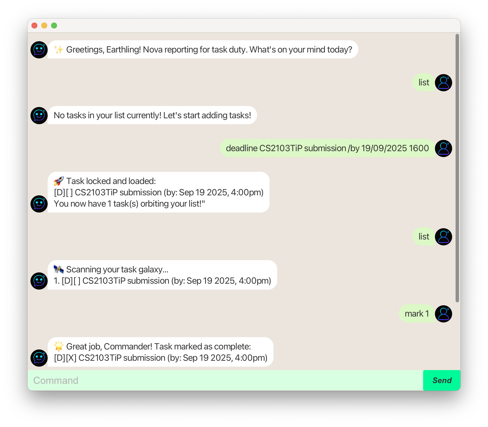

# NovaGPT User Guide

<p align="center"></p>

**NovaGPT** is a task management chatbot with a simple GUI built using JavaFX. It helps users manage various type of tasks, track completion, search by keyword and get reminders for upcoming tasks.

## Getting Started
Prerequisites: JDK 17

1. Download the latest novagpt.jar file from [here](https://github.com/balkinaveen/ip/releases/).<br>
2. Open a terminal in the folder where the jar is located.
3. Run:
   ```
   java -jar novagpt.jar
   ```
## Usage of the Chatbot
When NovaGPT starts, you'll see:
```
Hello!
Hope you're having a nice day!
What can I do for you today?
```
## Adding Todos
Adds a simple task without any date/time <br>
**Format:**
```
todo <task description>
```
**Example:**
```
todo read book
```
**Expected output:**
```
Got it. I've added this task:
[T][ ] read book
Now you have 1 tasks in the list.
```
## Adding Deadlines
Adds a task with a deadline <br>
**Format:**
```
deadline <task description> /by <DD/MM/YYYY HHMM>
```
**Example:**
```
deadline submit report /by 15/09/2025 2359
```
**Expected output:**
```
Got it. I've added this task:
[D][ ] submit report (by: Sep 15 2025, 11:59pm)
Now you have 2 tasks in the list.
```
## Adding Events
Adds a task with a start and end time <br>
**Format:**
```
event <task description> /from <DD/MM/YYYY HHMM> /to <DD/MM/YYYY HHMM>
```
**Example:**
```
event CS 2103T project meeting /from 15/09/2025 1500 /to 15/09/2025 1700
```
**Expected output:**
```
Got it. I've added this task:
[E][ ] submit report (from: Sep 15 2025, 03:00pm to: Sep 15 2025, 05:00pm)
Now you have 3 tasks in the list.
```
## Marking and Unmarking Tasks
Marks or unmarks a task as done <br>
**Format:**
```
mark <task number>
unmark <task number>
```
**Example:**
```
mark 1
```
**Expected output:**
```
Nice! I've marked this task as done:
[T][X] read book
```
**Example:**
```
unmark 1
```
**Expected output:**
```
OK, I've marked this task as not done yet:
[T][ ] read book
```
## Deleting Tasks
Deletes a task from the list <br>
**Format:**
```
delete <task number>
```
**Example:**
```
delete 2
```
**Expected output:**
```
Noted. I've removed this task as done:
[D][ ] submit report (by: Sep 15 2025, 11:59pm)
Now you have 2 tasks in the list.
```
## Listing All Tasks
Shows all tasks in your list <br>
**Format:**
```
list
```
**Example:**
```
list
```
**Expected output:**
```
1. [T][ ] read book
2. [E][ ] CS 2103T project meeting (from: Sep 15 2025, 3:00pm to: Sep 15 2025, 5:00pm)
```
## Listing All Tasks
Finds tasks containing a keyword <br>
**Format:**
```
find <keyword>
```
**Example:**
```
find book
```
**Expected output:**
```
Here are the matching tasks in your list:
1. [T][ ] read book
```
## Reminder
Shows upcoming deadlines and events with the next user specified days <br>
**Format:**
```
reminder <number of days>
```
**Example:**
```
reminder 2
```
**Expected output:**
```
Here are your upcoming tasks within the next 2 days
1. [E][ ] CS 2103T project meeting (from: Sep 15 2025, 3:00pm to: Sep 15 2025, 5:00pm)
```
## Exiting the App
Exits the app <br>
**Format:**
```
bye
```
**Expected output:**
```
Bye. Hope to see you soon!
HAND!
```
## Important Notes
- All dates and times must follow the following format: `DD/MM/YYYY HHMM (24-hour clock)`
- Tasks are stored in a text file under the `./data` directory
